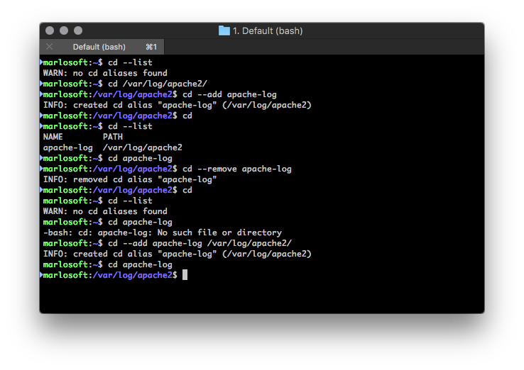

cd-alias bash extension
=======================

## Description

Creates aliases for your `cd` bash command.



## Installation

```bash
git clone https://github.com/marlosoft/cd-alias.git ~/.cd-alias
cd ~/.cd-alias/
bash ./install.sh
```

## TODO

- [ ] Add auto-completion
- [ ] Check which is faster (using file or sqlite3)
